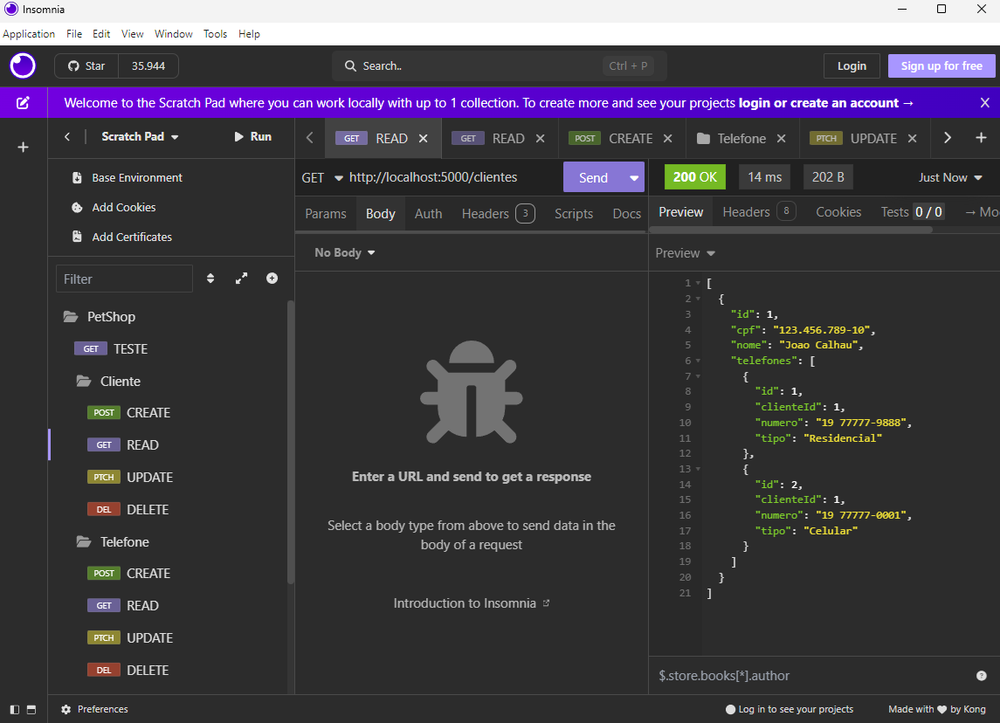
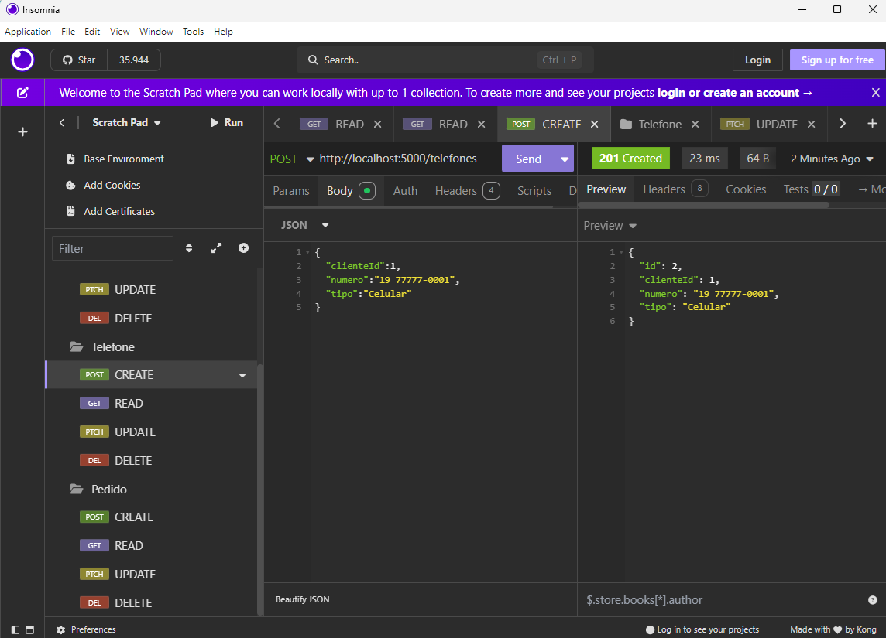
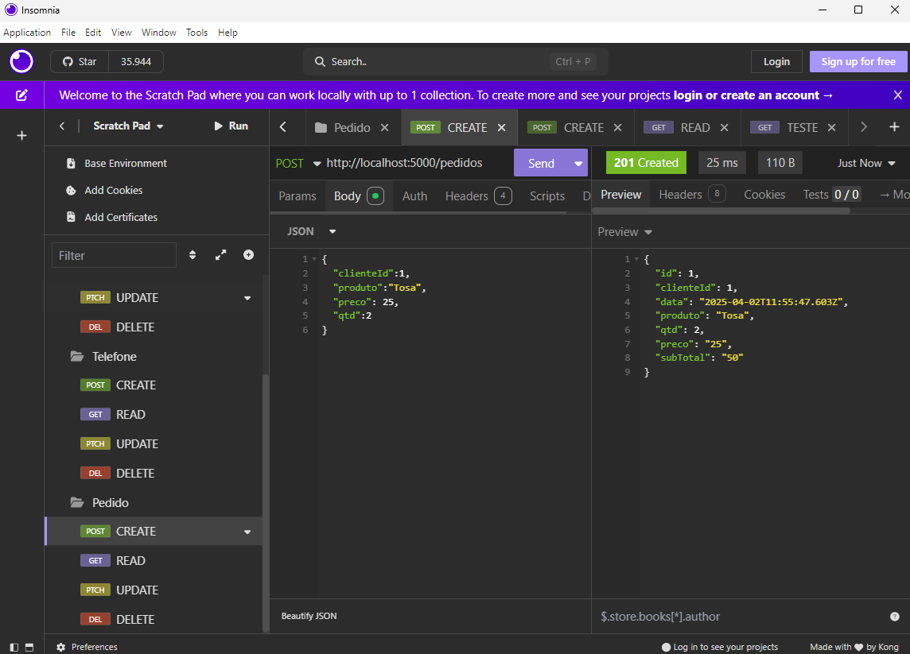
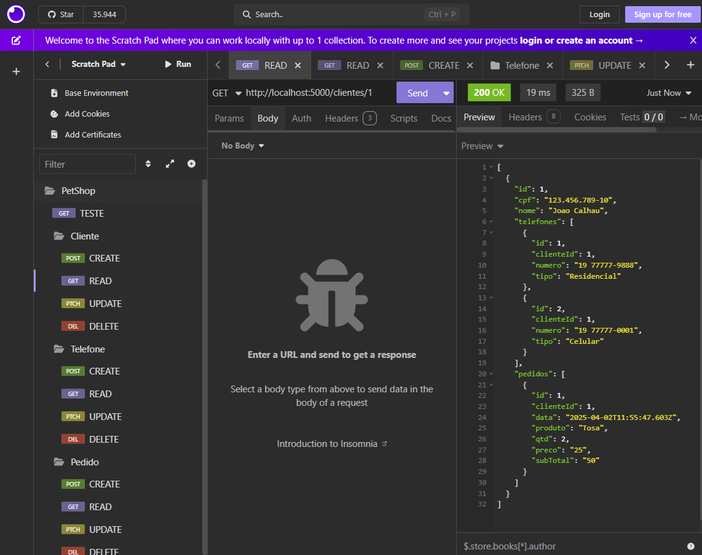

# SNOOPY PetSHop
- API Back-end para estudos de um sistema de registro de pedidos no balcão de um petshop

|MER x DER e Diagrama de Classes|
|-|
||


## Tecnologias
- Node.JS
- VsCode
- XAMPP
- Insomnia
## Passo a passo de como testar
### Back-End
- 1 Clone este repositório
- 2 Abra com VsCode, abra um terminal **CTRL + '** cmd ou bash, navegue até a pasta ./api e escute os seguintes comandos
```bash
cd api
npm install
```
- 3 Crie o arquivo **.env** na pasta api contendo as variáveis de ambiente
```js
DATABASE_URL="mysql://root@localhost:3306/petshop?schema=public&timezone=UTC"
PORT=5000
```
- 4 Abra o XAMPP Control Panel e de start no MySQL
- 5 No terminal instale o prisma globalmente e execute o comando da migração
```bash
npm i prisma -g
npx prisma migrate dev --name init
```
- 6 Execute a API e faça os testes com o **Insomnia**
```bash
npm start
# ou
npx nodemon
```
- 7 Abra o insomnia e importe as rotas de teste de ./docs/insomina.yaml

|Testes com Insomnia|
|-|
|
|
|
|
